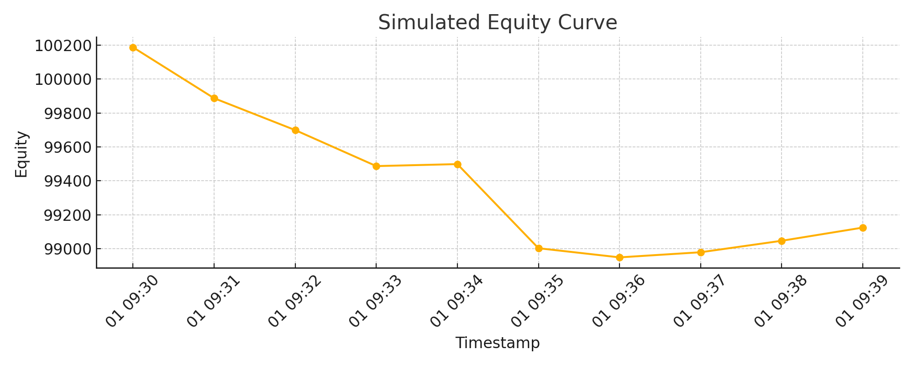

# ⚡ Rust / Python Back-Tester

This project is a blazing-fast, modular back-testing engine for financial strategies, built with Rust and exposed to Python via `pyo3`. It enables:

- **High-performance** tick-level backtesting
- **Walk-forward evaluation**
- **Parameter grid search**
- **Beautiful plots with Matplotlib and Pandas**

---

## 📈 Example Output



---

## 📦 Features

- Pure Rust core for fast execution and memory safety
- SMA Crossover strategy implemented as a modular `strategy.rs`
- Supports CSV tick data (timestamp, price, volume)
- Equity tracking with commission & PnL calculations
- Export equity curve as a Pandas DataFrame using Polars or native CSV
- Compatible with Python 3.8+ via `maturin`

---

## 🛠 Installation

### 1. Install `maturin`

```bash
pip install maturin
```

### 2. Build Rust extension

```bash
cd rust_core
maturin develop --release
cd ..
```

---

## 🚀 Usage

Run the demo notebook to:

- Run a single backtest
- View equity curve
- Perform walk-forward testing

```python
import json, rust_core as rc, pandas as pd, matplotlib.pyplot as plt

cfg = json.dumps({"fast": 50, "slow": 200, "initial_capital": 100_000})
rows = rc.backtest("data/es_tick_sample.csv", cfg)

df = pd.DataFrame(rows, columns=["ts_ms", "equity", "sharpe"])
df["ts"] = pd.to_datetime(df.ts_ms, unit="ms")
df.plot(x="ts", y="equity", figsize=(12, 4), title="Equity Curve")
plt.show()
```

---

## 📂 Project Structure

```
BackTester/
├── rust_core/          # Rust backend
│   ├── src/
│   │   ├── engine.rs   # Core event loop and execution
│   │   ├── strategy.rs # SMA crossover strategy
│   │   ├── events.rs   # Event queue system
│   │   ├── data.rs     # CSV reader and Tick struct
│   │   └── lib.rs      # PyO3 entrypoint
├── data/
│   └── es_tick_sample.csv
├── notebooks/
│   └── demo.ipynb
├── readme.md
└── equity_curve_preview.png
```

---

## 🧠 Credits

Built by [Yuvraj Malik](https://github.com/developer-2046) – combining low-level systems power with Python flexibility.